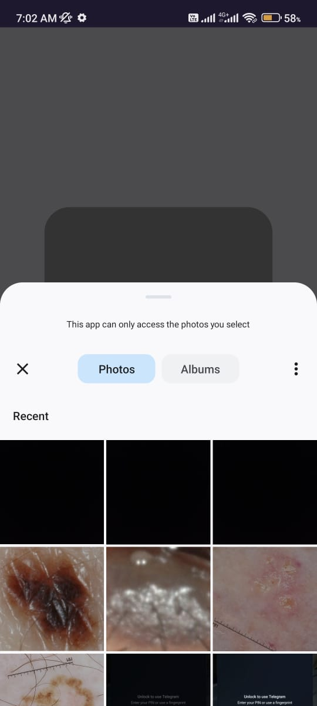
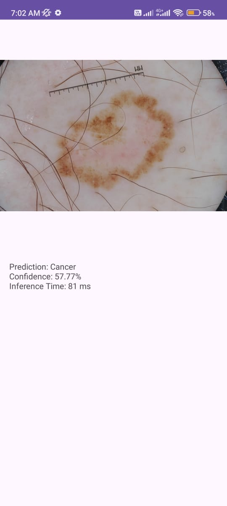

# Asclepius: Cancer Detection App 🏥🔬

**Asclepius** is a simple Android app that uses machine learning to detect the possibility of cancer from images. The app allows users to select images from their gallery and provides a prediction based on a pre-trained TensorFlow Lite model.

## Demo 🪟 

  

## Setup ⚙️🛠️

| Tools                                   | Installation                                  |
| --------------------------------------- | --------------------------------------------- |
| - **Android Studio**                    | - **Clone the Repository**                    |
| - **Gradle**                            | - Open the Project in Android Studio          |
| - **OpenJDK**                           | - Run the App                                 |
| - **Kotlin**                            |                                               |
| - **TensorFlow Lite**                   |                                               |

---
